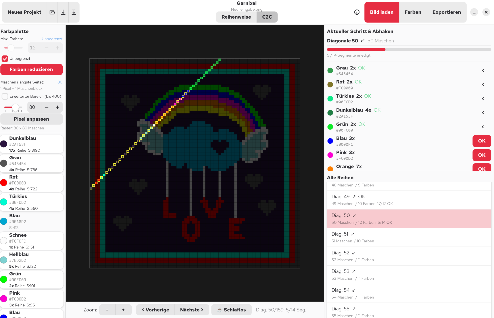

# 🧶 Garnixel

**Garnixel** verwandelt beliebige Pixelbilder in Häkelanleitungen —
Reihe für Reihe oder diagonal im Corner-to-Corner-Verfahren (C2C).

Entwickelt von **DiSteMa** & **JohnJayMcKaye**

---

## Funktionen

- **Bild importieren** — PNG und JPEG werden unterstützt
- Diese Pixelgrafiken können vorher Zielgerichtet mit z.B. [Pixelorama](https://pixelorama.org/) erstellt werden
- **Farbreduktion** — automatische K-Means-Farbreduktion auf 2–30 Farben (oder unbegrenzt)
- **Pixelraster** — frei einstellbar von 5 bis 400 Maschen (längste Seite)
- **Zwei Anleitungsmodi**
  - *Reihenweise* → / ← (klassisch)
  - *Corner-to-Corner (C2C)* ↗ / ↙ (diagonal)
- **Farben benennen** — jedem Farbwert kann ein eigener Name gegeben werden (z. B. „Himmelblau")
- **Fortschritt abhaken** — Segmente pro Reihe einzeln abhaken, Gesamtfortschritt wird angezeigt
- **Schlaflos-Modus** ☕ — verhindert Standby und Monitor-Abschaltung während des Häkelns
- **Projekt speichern & laden** — eigenes `.garn`-Dateiformat (JSON-basiert)
- **Exportieren** — Anleitung als lesbare `.txt`-Datei, oder `.pdf` in Farbe

---

## Screenshot



---

## Voraussetzungen

### System
- Linux (getestet auf **Fedora**)
- Python 3.10+
- GTK4 + libadwaita

Garnixel ist eine Linux-native GTK4-App — das ist eine Stärke, kein Fehler. 

### Flatpak Installation (empfohlen)
Garnixel basiert auf der GNOME-Plattform (GTK4 + libadwaita).
Diese muss einmalig heruntergeladen werden:

```bash
# GNOME Plattform (Laufzeit für den Endnutzer)
flatpak install flathub org.gnome.Platform//46

# GNOME SDK (wird nur zum Bauen benötigt)
flatpak install flathub org.gnome.Sdk//46

flatpak install garnixel-local de.garnixel.app
```
### App starten

```bash
flatpak run de.garnixel.app
```
---

## Bedienung

### 1. Bild laden
Klicke auf **„Bild laden"** in der Headerbar und wähle ein PNG oder JPEG.

### 2. Einstellungen anpassen
In der linken Spalte lassen sich einstellen:
- **Max. Farben** — Slider oder Zahleneingabe (2–30), oder „Unbegrenzt"
- **Maschen** — Slider oder Zahleneingabe (5–120, mit erweitertem Bereich bis 400)

Nach Änderungen die jeweiligen Buttons „Farben reduzieren" bzw. „Pixel anpassen" drücken.

### 3. Farben benennen
Über **„🎨 Farben"** in der Headerbar können alle erkannten Farben mit eigenen Namen versehen werden (z. B. „Hellblau", „Cremeweiß"). Diese Namen erscheinen dann in der Palette, in den Schritten und im Export.

### 4. Modus wählen
Zwischen **Reihenweise** und **C2C** kann oben in der Mitte umgeschaltet werden.
> ⚠️ Ein Moduswechsel löscht den bisherigen Fortschritt — ein Warnhinweis erscheint wenn bereits Segmente abgehakt wurden.

### 5. Häkeln & Fortschritt abhaken
- Mit **„< Vorherige"** / **„Nächste >"** durch die Reihen navigieren
- Segmente in der rechten Spalte einzeln mit **„OK"** abhaken
- **„OK Alle abhaken"** / **„Zurücksetzen"** für alle Segmente der aktuellen Reihe

### 6. Schlaflos-Modus ☕
Der **☕ Schlaflos**-Button in der Canvas-Navigationsleiste verhindert, dass der Computer während des Häkelns in den Standby geht oder der Monitor sich abschaltet. Nutzt `systemd-inhibit` (Fedora-nativ).

### 7. Speichern & Laden
- **Speichern** / **Speichern unter** — speichert das Projekt als `.garn`-Datei
- **Öffnen** — lädt ein gespeichertes `.garn`-Projekt inklusive Fortschritt
- Beim Schließen des Fensters wird bei ungespeichertem Fortschritt nachgefragt

### 8. Exportieren
Über **„Exportieren"** wird eine lesbare `.txt/,pdf`-Anleitung erstellt:
- Sind alle Farben benannt, erscheinen **die Namen** (kein Hex-Code)
- Ist eine Farbe unbenannt, erscheint ihr Hex-Code

---

## Dateiformat `.garn`

Garnixel speichert Projekte als JSON mit der Endung `.garn`:

```json
{
  "version": 2,
  "pattern": {
    "image_path": "/pfad/zum/bild.png",
    "max_size": 40,
    "max_colors": 12,
    "grid": [...],
    "palette": {...},
    "color_names": {"#ff0000": "Rot"}
  },
  "mode": "row",
  "current_row": 5,
  "checked_segments": {"3": [0, 1, 2]}
}
```

---

## Lizenz

Dieses Projekt ist ein privates Gemeinschaftsprojekt von **DiSteMa** und **JohnJayMcKaye**.
Nutzung und Weitergabe nach Absprache mit den Entwicklern.

---

*Garnixel — Garn + Pixel. Für alle kreativen Häkler da draußen. 🧶*
